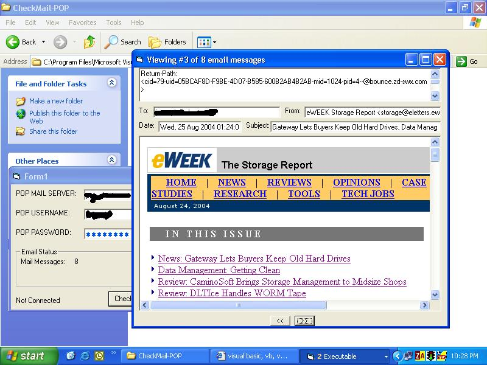



## POP\_MAIL

### Description

---UPDATED AGAIN---

Now Deletes messages of the Host!

Also gets attachments...

Currently though, it only handles one attachment per email.

This is a program that will connect to your pop mail host and download your email, then parse it, then show you your mail either in html or text.
 
### More Info
 
Assumes you have IQ over 50,

in other words, its pretty simple!

             |
---                |---
**Submitted On**   |2004-08-28 00:04:18
**By**             |[Jason Barrera](https://github.com/Planet-Source-Code/PSCIndex/blob/master/ByAuthor/jason-barrera.md)
**Level**          |Advanced
**User Rating**    |4.4 (22 globes from 5 users)
**Compatibility**  |VB 6\.0
**Category**       |[Complete Applications](https://github.com/Planet-Source-Code/PSCIndex/blob/master/ByCategory/complete-applications__1-27.md)
**World**          |[Visual Basic](https://github.com/Planet-Source-Code/PSCIndex/blob/master/ByWorld/visual-basic.md)
**Archive File**   |[POP\_MAIL1786798282004\.zip](https://github.com/Planet-Source-Code/jason-barrera-pop-mail__1-55843/archive/master.zip)

### API Declarations

---NONE---

